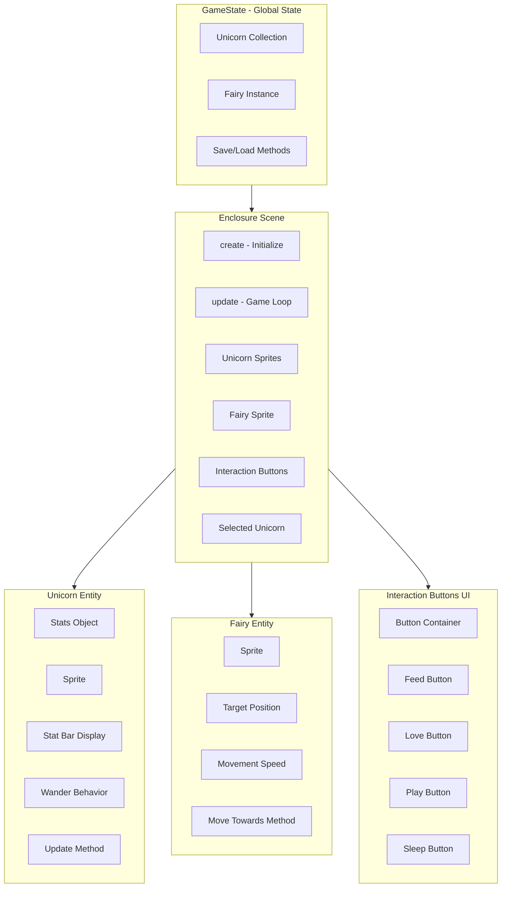

# Enclosure Interaction System - Implementation Plan

**Created:** 2026-02-14  
**Feature:** Multiple unicorns with fairy-based interaction system

## Overview

Implement a complete interaction system for the Enclosure scene where:
- Multiple unicorns wander the enclosure with visible stat bars
- Player clicks a unicorn to send the fairy towards it
- When fairy arrives, interaction buttons appear around the unicorn
- Button clicks reduce the corresponding stat

## Architecture Diagram



## Phase 1: Multiple Unicorn Support

### 1.1 Update GameState for Unicorn Collection

**File:** [`src/systems/GameState.js`](src/systems/GameState.js)

**Changes:**
- Add methods to add/remove unicorns
- Ensure save/load handles unicorn serialization
- Track active unicorn IDs

**New Methods:**
```javascript
addUnicorn(unicorn)    // Add unicorn to collection
removeUnicorn(id)      // Remove unicorn by ID
getUnicorn(id)         // Get unicorn by ID
getAllUnicorns()       // Return all unicorns
```

### 1.2 Update Unicorn Entity for Stat Bar Display

**File:** [`src/entities/Unicorn.js`](src/entities/Unicorn.js)

**Changes:**
- Add stat bar display that follows the unicorn
- Add wandering behavior properties
- Add position tracking

**New Properties:**
```javascript
this.x = 0                    // Current X position
this.y = 0                    // Current Y position
this.wanderTimer = 0          // Time until direction change
this.wanderDirection = { x: 0, y: 0 }  // Current movement direction
this.statBarContainer = null  // Reference to stat bar display
```

**New Methods:**
```javascript
createStatBars(scene)         // Create stat bar display above unicorn
updateStatBars()              // Update stat bar visuals
wander(bounds, delta)         // Random wandering within bounds
setPosition(x, y)             // Update position and sprite
```

### 1.3 Update EnclosureScene for Multiple Unicorns

**File:** [`src/scenes/EnclosureScene.js`](src/scenes/EnclosureScene.js)

**Changes:**
- Remove single test unicorn, use GameState collection
- Create sprites for all unicorns in GameState
- Update all unicorns in update loop
- Track enclosure bounds for wandering

**New Properties:**
```javascript
this.unicorns = []            // Array of unicorn instances
this.enclosureBounds = {      // Boundary for wandering
    x: 100, y: 100,
    width: 1080, height: 520
}
```

**New Methods:**
```javascript
initializeUnicorns()          // Create sprites for GameState unicorns
spawnUnicorn(config)          // Add new unicorn to scene
```

### 1.4 Testing Checkpoint

- [ ] Multiple unicorns display in enclosure
- [ ] Each unicorn has stat bars above it
- [ ] Stats decay for all unicorns
- [ ] Growth progresses for all unicorns
- [ ] No console errors

---

## Phase 2: Unicorn Wandering

### 2.1 Add Wandering Behavior to Unicorn

**File:** [`src/entities/Unicorn.js`](src/entities/Unicorn.js)

**Changes:**
- Implement random direction changes
- Move sprite within bounds
- Respect movement speed modifier when unhappy

**Wandering Logic:**
```
Every 2-4 seconds:
  Pick random direction (-1 to 1 for x and y)
  Normalize direction vector
  
Every frame:
  Move in current direction at speed
  If hitting boundary, bounce/reverse
  Apply movementSpeed modifier if unhappy
```

### 2.2 Update EnclosureScene Bounds Handling

**File:** [`src/scenes/EnclosureScene.js`](src/scenes/EnclosureScene.js)

**Changes:**
- Pass enclosure bounds to unicorn wander method
- Define safe area for wandering

### 2.3 Testing Checkpoint

- [ ] Unicorns wander slowly around enclosure
- [ ] Unicorns stay within bounds
- [ ] Unhappy unicorns move slower
- [ ] Direction changes appear natural

---

## Phase 3: Fairy Movement

### 3.1 Update Fairy Entity

**File:** [`src/entities/Fairy.js`](src/entities/Fairy.js)

**Changes:**
- Add position tracking
- Add movement towards target
- Add arrival detection

**New Properties:**
```javascript
this.x = 0                    // Current X position
this.y = 0                    // Current Y position
this.targetX = null           // Target X to move towards
this.targetY = null           // Target Y to move towards
this.isMoving = false         // Currently moving flag
this.speed = 200              // Movement speed in pixels/second
this.arrivalThreshold = 30    // Distance considered arrived
```

**New Methods:**
```javascript
moveTowards(x, y)             // Set target and start moving
update(delta)                 // Move towards target each frame
hasArrived()                  // Check if reached target
setPosition(x, y)             // Set position immediately
```

### 3.2 Update EnclosureScene for Click Handling

**File:** [`src/scenes/EnclosureScene.js`](src/scenes/EnclosureScene.js)

**Changes:**
- Track selected unicorn
- Handle unicorn click events
- Move fairy towards clicked unicorn

**New Properties:**
```javascript
this.selectedUnicorn = null   // Currently selected unicorn
this.fairy = null             // Fairy instance
```

**New Methods:**
```javascript
handleUnicornClick(unicorn)   // Handle unicorn selection
updateFairyMovement(delta)    // Update fairy position
onFairyArrival()              // Called when fairy reaches target
```

### 3.3 Testing Checkpoint

- [ ] Clicking unicorn selects it
- [ ] Fairy moves towards clicked unicorn
- [ ] Fairy stops when reaching unicorn center
- [ ] Clicking different unicorn changes target
- [ ] Fairy sprite updates position correctly

---

## Phase 4: Interaction Buttons

### 4.1 Create InteractionButtons Class

**File:** `src/ui/InteractionButtons.js` (NEW)

**Purpose:** Radial menu of action buttons around unicorn

**Structure:**
```javascript
class InteractionButtons {
    constructor(scene)
    show(x, y)                // Display buttons at position
    hide()                    // Hide all buttons
    setOnFeed(callback)       // Set feed button callback
    setOnLove(callback)       // Set love button callback
    setOnPlay(callback)       // Set play button callback
    setOnSleep(callback)      // Set sleep button callback
}
```

**Visual Layout:**
```
        [Feed]
   [Sleep]  [Love]
        [Play]
```

**Button Design:**
- Circular buttons with icons
- Positioned in circle around unicorn center
- Semi-transparent background
- Scale up on hover

### 4.2 Update PlaceholderGraphics for Buttons

**File:** [`src/utils/PlaceholderGraphics.js`](src/utils/PlaceholderGraphics.js)

**New Function:**
```javascript
generateButtonTexture(scene, type, size)
// type: feed, love, play, sleep
// Returns texture key
```

### 4.3 Update EnclosureScene for Button Display

**File:** [`src/scenes/EnclosureScene.js`](src/scenes/EnclosureScene.js)

**Changes:**
- Create InteractionButtons instance
- Show buttons when fairy arrives
- Hide buttons when clicking elsewhere
- Handle button clicks to reduce stats

**New Methods:**
```javascript
showInteractionButtons(unicorn)
hideInteractionButtons()
handleFeedClick()
handleLoveClick()
handlePlayClick()
handleSleepClick()
```

### 4.4 Testing Checkpoint

- [ ] Buttons appear when fairy reaches unicorn
- [ ] Buttons positioned correctly around unicorn
- [ ] Feed button reduces food stat
- [ ] Love button reduces love stat
- [ ] Play button reduces play stat
- [ ] Sleep button reduces sleep stat
- [ ] Clicking another unicorn hides buttons and moves fairy
- [ ] Clicking empty space hides buttons

---

## File Changes Summary

| File | Phase | Changes |
|------|-------|---------|
| `src/systems/GameState.js` | 1 | Add unicorn collection methods |
| `src/entities/Unicorn.js` | 1, 2 | Add stat bars, wandering, position |
| `src/entities/Fairy.js` | 3 | Add movement, targeting |
| `src/scenes/EnclosureScene.js` | 1-4 | Major refactor for all features |
| `src/ui/InteractionButtons.js` | 4 | NEW - Button UI component |
| `src/utils/PlaceholderGraphics.js` | 4 | Add button texture generation |

---

## Technical Notes

### Stat Reduction Amounts
Per GAME_RULES.md, stat reduction amounts should be tunable. Suggested starting values:
```javascript
const STAT_REDUCTION = {
    feed: 30,
    love: 20,
    play: 25,
    sleep: 35
};
```

### Fairy Movement Speed
Should be fast enough to feel responsive but slow enough to see movement:
- Suggested: 200 pixels/second
- Enclosure is ~1080 wide, so ~5 seconds to cross

### Wandering Parameters
```javascript
const WANDER_CONFIG = {
    directionChangeInterval: 3000,  // ms between direction changes
    baseSpeed: 30,                   // pixels/second
    unhappySpeedMultiplier: 0.5      // slower when unhappy
};
```

---

## Risks and Considerations

1. **Performance with many unicorns:** Update loop should be efficient. Consider limiting active unicorns if performance issues arise.

2. **Stat bar overlap:** With multiple unicorns, stat bars might overlap. Consider dynamic positioning or fading distant bars.

3. **Fairy pathfinding:** Simple direct movement is used. If obstacles are added later, pathfinding may be needed.

4. **Save/Load timing:** Per GAME_RULES.md, saves only at day/night transitions. Ensure unicorn positions are included in save data.

---

## Next Steps After Completion

1. Day/Night cycle implementation
2. Fairy auto-fix behavior with cooldowns
3. Overworld scene development
4. Minigame integration for fairy learning
