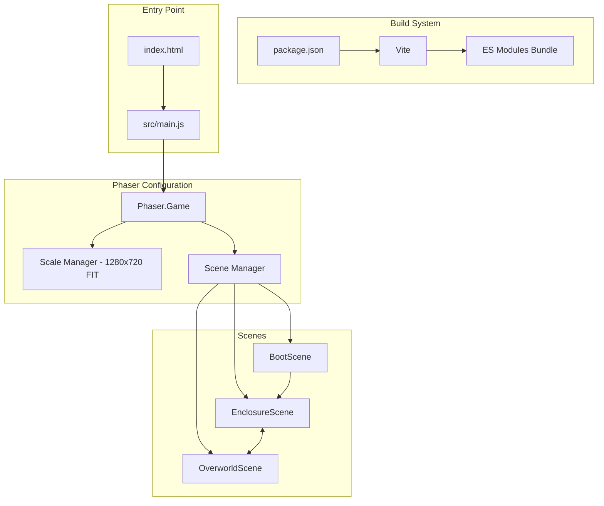

# Main.js Entry Point Implementation Plan

## Overview

Set up a proper Vite-based build system with ES Modules for the Phaser 3 project, and create the main.js entry point with 16:9 landscape resolution configuration.

## Requirements from GAME_RULES.md

- **Engine:** Phaser 3 (JavaScript/ES Modules)
- **Resolution:** 16:9 Landscape, responsive `Scale.FIT`
- **Stage Isolation:** Only active Scene processes logic
- **Scenes:** Boot, Enclosure, Overworld

## Implementation Steps

### Step 1: Update package.json

Add Vite as a dev dependency and update scripts:

```json
{
  "name": "unicorns-and-fairies",
  "version": "1.0.0",
  "type": "module",
  "scripts": {
    "dev": "vite",
    "build": "vite build",
    "preview": "vite preview"
  },
  "devDependencies": {
    "vite": "^5.0.0"
  },
  "dependencies": {
    "phaser": "^3.90.0"
  }
}
```

### Step 2: Update index.html

Restructure for Vite entry point:

```html
<!DOCTYPE html>
<html lang="en">
<head>
    <meta charset="UTF-8">
    <meta name="viewport" content="width=device-width, initial-scale=1.0">
    <title>Unicorns and Fairies</title>
    <style>
        * {
            margin: 0;
            padding: 0;
            box-sizing: border-box;
        }
        body {
            background-color: #1a1a2e;
            display: flex;
            justify-content: center;
            align-items: center;
            min-height: 100vh;
        }
        #game-container {
            display: flex;
            justify-content: center;
            align-items: center;
        }
    </style>
</head>
<body>
    <div id="game-container"></div>
    <script type="module" src="/src/main.js"></script>
</body>
</html>
```

### Step 3: Create src/main.js

The main entry point with Phaser configuration:

```javascript
import Phaser from 'phaser';
import BootScene from './scenes/BootScene.js';
import EnclosureScene from './scenes/EnclosureScene.js';
import OverworldScene from './scenes/OverworldScene.js';

// Game configuration
const config = {
    type: Phaser.AUTO,
    parent: 'game-container',
    width: 1280,  // 16:9 aspect ratio
    height: 720,
    backgroundColor: '#2d2d44',
    scale: {
        mode: Phaser.Scale.FIT,
        autoCenter: Phaser.Scale.CENTER_BOTH
    },
    scene: [BootScene, EnclosureScene, OverworldScene]
};

// Initialize game
const game = new Phaser.Game(config);
```

### Step 4: Create Scene Files

#### src/scenes/BootScene.js

```javascript
import Phaser from 'phaser';

class BootScene extends Phaser.Scene {
    constructor() {
        super({ key: 'BootScene' });
    }

    preload() {
        // Load assets here
        this.load.on('complete', () => {
            this.scene.start('EnclosureScene');
        });
    }

    create() {
        // If no assets to load, proceed immediately
        this.scene.start('EnclosureScene');
    }
}

export default BootScene;
```

#### src/scenes/EnclosureScene.js

```javascript
import Phaser from 'phaser';

class EnclosureScene extends Phaser.Scene {
    constructor() {
        super({ key: 'EnclosureScene' });
    }

    create() {
        // Main gameplay scene for unicorn care
        this.add.text(640, 360, 'Enclosure Scene', {
            fontSize: '32px',
            fill: '#fff'
        }).setOrigin(0.5);
    }
}

export default EnclosureScene;
```

#### src/scenes/OverworldScene.js

```javascript
import Phaser from 'phaser';

class OverworldScene extends Phaser.Scene {
    constructor() {
        super({ key: 'OverworldScene' });
    }

    create() {
        // Exploration/map scene
        this.add.text(640, 360, 'Overworld Scene', {
            fontSize: '32px',
            fill: '#fff'
        }).setOrigin(0.5);
    }
}

export default OverworldScene;
```

## Architecture Diagram



## File Structure After Implementation

```
unicorns-and-fairies/
├── index.html              # Updated for Vite
├── package.json            # Updated with Vite
├── vite.config.js          # Optional Vite config
├── src/
│   ├── main.js             # Entry point with Phaser config
│   ├── scenes/
│   │   ├── BootScene.js
│   │   ├── EnclosureScene.js
│   │   └── OverworldScene.js
│   ├── entities/
│   │   └── Unicorn.js      # Existing
│   └── systems/
│       └── GameState.js    # Existing
└── assets/                 # Game assets
```

## Commands to Run

After implementation:

```bash
npm install
npm run dev
```

## Notes

- The 16:9 aspect ratio is achieved with 1280x720 base resolution
- `Phaser.Scale.FIT` ensures the game scales responsively while maintaining aspect ratio
- `Phaser.Scale.CENTER_BOTH` centers the canvas in the container
- All scene classes use ES6 class syntax and export default
- Scene keys are defined in constructors for clarity
