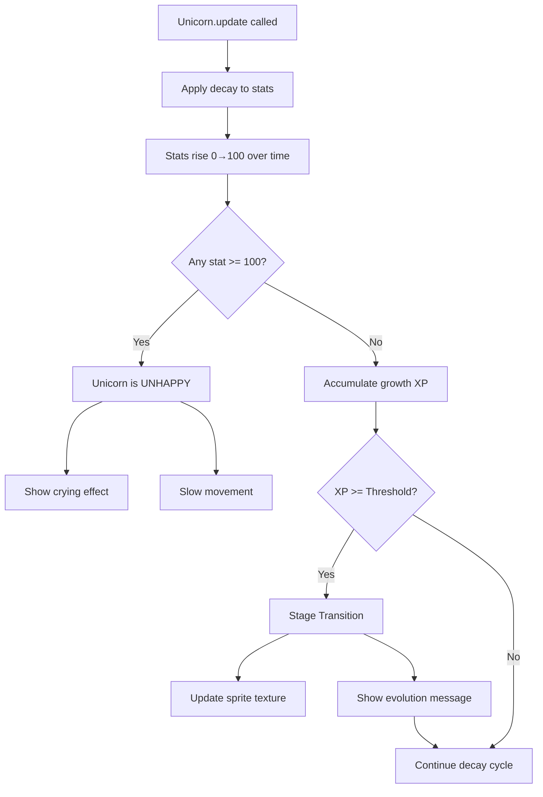

# Unicorn Stats & Growth System Implementation Plan

## Overview

Implement the core stat decay and growth system for unicorns as specified in GAME_RULES.md. This will enable unicorns to progress through stages (Young → Teen → Adult) based on their stats and provide visual feedback when they become unhappy.

## Requirements Summary

| Feature | Description |
|---------|-------------|
| **Stat Decay** | Stats (food, love, play, sleep) rise over time from 0 to 100 |
| **Unhappy State** | When any stat reaches 100, unicorn becomes unhappy |
| **Growth XP** | Hidden XP fills when all stats are < 100 |
| **Stage Transitions** | Young → Teen → Adult based on growth progress |
| **Visual Feedback** | Unhappy unicorns show crying animation, movement slows |

---

## Implementation Steps

### Step 1: Create Feature Branch

```bash
git checkout -b feature/unicorn-stats-growth
```

### Step 2: Update Unicorn.js - Add Stat Decay Configuration

**File:** `src/entities/Unicorn.js`

Add decay rates and growth thresholds:

```javascript
// Add to constructor or as class constants
static DECAY_RATES = {
    food: 2.5,    // Points per second
    love: 1.5,
    play: 3.0,
    sleep: 1.0
};

static STAGE_THRESHOLDS = {
    Young: 100,
    Teen: 300,
    Adult: 600
};
```

### Step 3: Update Unicorn.js - Implement update() Method

**File:** `src/entities/Unicorn.js`

The `update(delta)` method should:
1. Apply decay to each stat based on `delta` time
2. Clamp stats between 0 and 100
3. Update `isUnhappy` state
4. Accumulate growth XP when all stats < 100

```javascript
update(delta) {
    // delta is in milliseconds, convert to seconds
    const deltaSeconds = delta / 1000;
    
    // Apply decay to each stat
    for (const stat in this.stats) {
        this.stats[stat] += Unicorn.DECAY_RATES[stat] * deltaSeconds;
        this.stats[stat] = Math.min(100, Math.max(0, this.stats[stat]));
    }
    
    // Check if unhappy (any stat at 100)
    this.isUnhappy = Object.values(this.stats).some(stat => stat >= 100);
    
    // Accumulate growth XP if all needs met
    if (!this.isUnhappy) {
        this.growthProgress += deltaSeconds * 10; // 10 XP per second when happy
        this.checkStageTransition();
    }
}
```

### Step 4: Implement Stage Transition Logic

**File:** `src/entities/Unicorn.js`

Add method to check and trigger stage changes:

```javascript
checkStageTransition() {
    const stages = ['Young', 'Teen', 'Adult'];
    const currentIndex = stages.indexOf(this.stage);
    
    if (currentIndex < stages.length - 1) {
        const nextStage = stages[currentIndex + 1];
        if (this.growthProgress >= Unicorn.STAGE_THRESHOLDS[nextStage]) {
            this.stage = nextStage;
            this.growthProgress = 0; // Reset for next stage
            return true; // Stage changed
        }
    }
    return false;
}
```

### Step 5: Update Unicorn.js - Add Visual Feedback Properties

**File:** `src/entities/Unicorn.js`

Add properties for visual feedback:

```javascript
// Add to constructor
this.isCrying = false;
this.movementSpeed = 1.0; // Multiplier
```

Update `update()` to set these:

```javascript
// Visual feedback state
this.isCrying = this.isUnhappy;
this.movementSpeed = this.isUnhappy ? 0.5 : 1.0; // Slower when unhappy
```

### Step 6: Update EnclosureScene - Drive Unicorn Updates

**File:** `src/scenes/EnclosureScene.js`

Modify the `update()` method to call unicorn updates:

```javascript
update(time, delta) {
    // Update unicorn stats
    if (this.testUnicorn) {
        this.testUnicorn.update(delta);
        this.updateStatBars();
        this.updateUnicornVisuals();
        
        // Check for stage transition
        if (this.testUnicorn.stageChanged) {
            this.testUnicorn.updateSpriteTexture(this);
            this.showStageTransitionMessage(this.testUnicorn.stage);
            this.testUnicorn.stageChanged = false;
        }
    }
}
```

### Step 7: Add Visual Feedback Methods to EnclosureScene

**File:** `src/scenes/EnclosureScene.js`

Add methods for visual feedback:

```javascript
/**
 * Update unicorn visual state based on mood
 */
updateUnicornVisuals() {
    if (!this.testUnicorn.sprite) return;
    
    const unicorn = this.testUnicorn;
    
    // Apply visual effects for unhappy state
    if (unicorn.isUnhappy) {
        // Add crying tint/overlay
        if (!unicorn.cryingEffect) {
            unicorn.cryingEffect = this.add.particles(0, 0, 'tear', {
                x: unicorn.sprite.x,
                y: unicorn.sprite.y - 30,
                lifespan: 1000,
                speed: { min: 20, max: 40 },
                scale: { start: 0.3, end: 0 },
                frequency: 200,
                emitting: true
            });
        }
        // Slow pulsing animation
        this.tweens.add({
            targets: unicorn.sprite,
            alpha: 0.7,
            duration: 500,
            yoyo: true,
            repeat: -1
        });
    } else {
        // Remove crying effect if exists
        if (unicorn.cryingEffect) {
            unicorn.cryingEffect.destroy();
            unicorn.cryingEffect = null;
        }
        // Happy bounce animation
        this.tweens.add({
            targets: unicorn.sprite,
            y: unicorn.sprite.y - 5,
            duration: 300,
            yoyo: true,
            repeat: -1
        });
    }
}

/**
 * Show stage transition message
 */
showStageTransitionMessage(newStage) {
    const message = this.add.text(
        this.cameras.main.width / 2,
        this.cameras.main.height / 2 - 100,
        `${this.testUnicorn.name} evolved to ${newStage}!`,
        {
            fontSize: '28px',
            fill: '#FFD700',
            stroke: '#000000',
            strokeThickness: 4
        }
    ).setOrigin(0.5);
    
    this.tweens.add({
        targets: message,
        y: message.y - 50,
        alpha: 0,
        duration: 2000,
        onComplete: () => message.destroy()
    });
}
```

### Step 8: Update PlaceholderGraphics for Tears

**File:** `src/utils/PlaceholderGraphics.js`

Add tear particle texture generation:

```javascript
generateTearTexture(scene) {
    const canvas = document.createElement('canvas');
    canvas.width = 8;
    canvas.height = 12;
    const ctx = canvas.getContext('2d');
    
    // Draw tear drop
    ctx.fillStyle = '#87CEEB';
    ctx.beginPath();
    ctx.arc(4, 4, 4, 0, Math.PI * 2);
    ctx.fill();
    
    scene.textures.addCanvas('tear', canvas);
}
```

Update `generateAllPlaceholders()` to include tears.

### Step 9: Update Stat Bars for Better Feedback

**File:** `src/scenes/EnclosureScene.js`

Modify `createStatBars()` to add warning colors when stats are critical:

```javascript
createStatBars(x, y) {
    const stats = ['food', 'love', 'play', 'sleep'];
    const colors = {
        food: 0xff9800,
        love: 0xe91e63,
        play: 0x4caf50,
        sleep: 0x9c27b0
    };
    const warningColor = 0xff0000; // Red when critical (>= 80)

    stats.forEach((stat, index) => {
        const yPos = y + (index * 30);
        const isCritical = this.testUnicorn.stats[stat] >= 80;
        
        // Label
        this.add.text(x, yPos, stat.charAt(0).toUpperCase() + stat.slice(1), {
            fontSize: '16px',
            fill: isCritical ? '#ff6666' : '#ffffff'
        });

        // Background bar
        this.add.rectangle(x + 130, yPos + 8, 100, 16, 0x333333).setOrigin(0, 0);
        
        // Fill bar
        const fillWidth = Math.max(1, 100 - this.testUnicorn.stats[stat]);
        const fillBar = this.add.rectangle(
            x + 131, yPos + 9, fillWidth, 14, 
            isCritical ? warningColor : colors[stat]
        ).setOrigin(0, 0);
        
        if (!this.statBars) this.statBars = {};
        this.statBars[stat] = fillBar;
    });
}
```

### Step 10: Update Stat Bar Color Dynamically

**File:** `src/scenes/EnclosureScene.js`

Update `updateStatBars()` to handle critical state:

```javascript
updateStatBars() {
    const stats = ['food', 'love', 'play', 'sleep'];
    const warningColor = 0xff0000;
    const colors = {
        food: 0xff9800,
        love: 0xe91e63,
        play: 0x4caf50,
        sleep: 0x9c27b0
    };

    stats.forEach(stat => {
        if (this.statBars && this.statBars[stat]) {
            const fillWidth = Math.max(1, 100 - this.testUnicorn.stats[stat]);
            this.statBars[stat].width = fillWidth;
            
            // Update color based on critical state
            const isCritical = this.testUnicorn.stats[stat] >= 80;
            this.statBars[stat].fillColor = isCritical ? warningColor : colors[stat];
        }
    });
}
```

---

## Files to Modify

| File | Changes |
|------|---------|
| `src/entities/Unicorn.js` | Add decay rates, update() method, stage transitions, visual feedback properties |
| `src/scenes/EnclosureScene.js` | Drive unicorn updates, add visual feedback methods, update stat bar colors |
| `src/utils/PlaceholderGraphics.js` | Add tear particle texture |

## Testing Checklist

- [ ] Stats decay over time when unicorn is idle
- [ ] Stats stop decaying when player interacts (not implemented yet, but decay should happen)
- [ ] Growth XP accumulates when all stats < 100
- [ ] Unicorn transitions to Teen at 100 growth XP
- [ ] Unicorn transitions to Adult at 300 growth XP
- [ ] Unicorn shows crying effect when any stat reaches 100
- [ ] Stat bars turn red when stats are critical (>= 80)
- [ ] Stage transition message appears on evolution
- [ ] No console errors during gameplay

## Balance Tuning Notes

The following values can be tuned in `Unicorn.js`:

| Parameter | Current Value | Purpose |
|-----------|---------------|---------|
| `DECAY_RATES.food` | 2.5 pts/sec | How fast hunger builds |
| `DECAY_RATES.love` | 1.5 pts/sec | How fast love need builds |
| `DECAY_RATES.play` | 3.0 pts/sec | How fast play need builds |
| `DECAY_RATES.sleep` | 1.0 pts/sec | How fast sleepiness builds |
| `growthXP` accumulation | 10 XP/sec | How fast unicorn grows when happy |
| `STAGE_THRESHOLDS.Young` | 100 XP | XP needed to reach Teen |
| `STAGE_THRESHOLDS.Teen` | 300 XP | XP needed to reach Adult |

---

## Mermaid Diagram: Stat Flow



---

## Next Steps (After This Feature)

Once this core system is complete, future features can build on it:

1. **Care Interactions** - Add UI buttons for feeding, playing, sleeping to reduce stats
2. **Fairy Auto-Fix** - Fairies can automatically reduce stats with cooldowns
3. **Overworld Exploration** - Apply stat effects to exploration mechanics
4. **Stage-Specific Behaviors** - Young unicorns lead to bed, Teens auto-sleep, Adults fly
